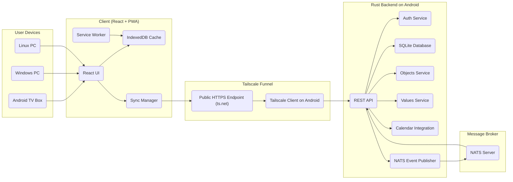
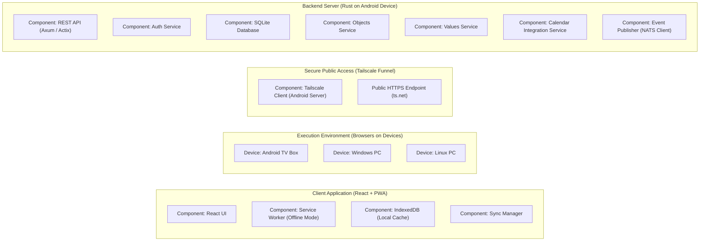
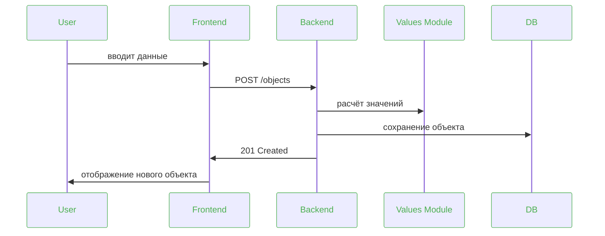
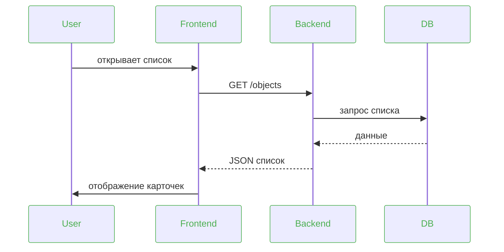
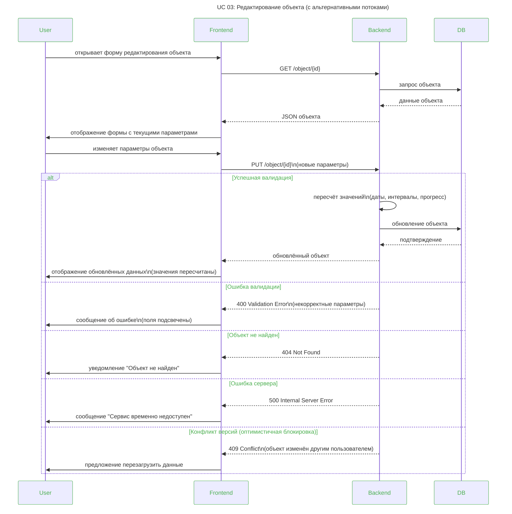
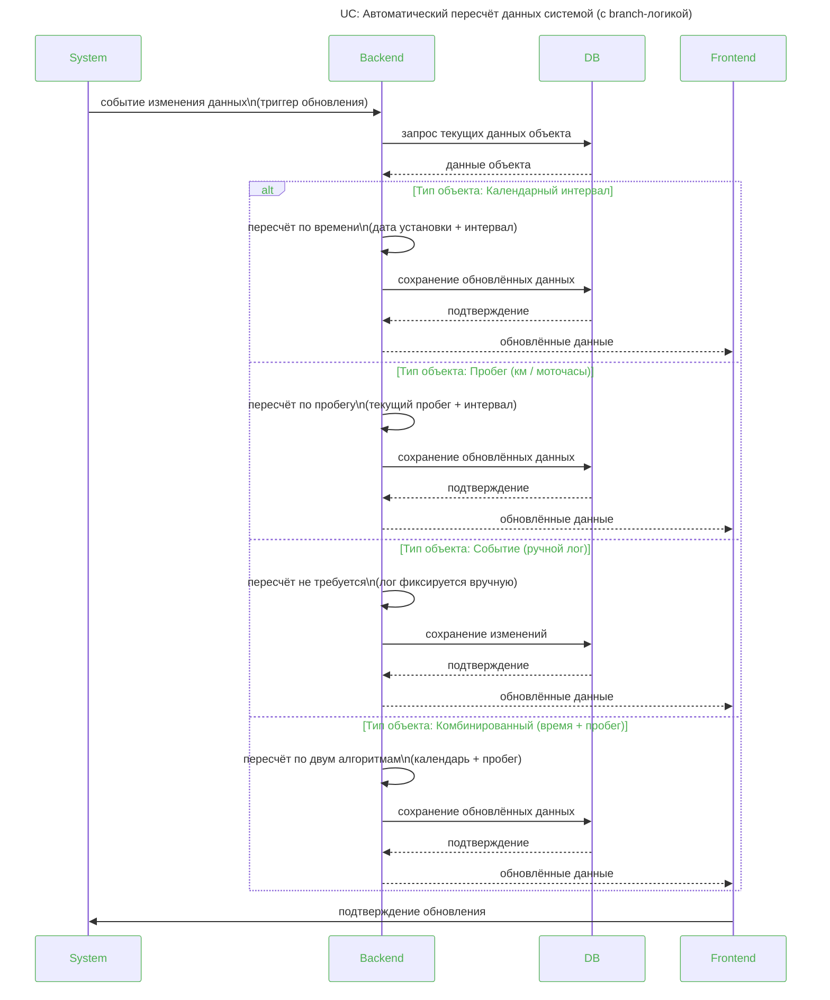

# 3	Архитектура системы

## 3.1	Логическая архитектура

## 3.2	Компоненты

-	Frontend (React + PWA клиентом)
-	Rust backend на Android (API Gateway / Backend API)
-	Objects Service
-	Values Service
-	Calendar Integration Service
- NATS как брокером сообщений
- SQLite (file-based) Storage

### 3.2.2 Развёртывание в Андроид ТВ боксе

- Серверная часть развёртывается непосредственно на Android TV Box, который используется как компактная, энергоэффективная и постоянно доступная платформа для backend‑сервиса.
- Запуск backend‑приложения выполняется в среде Termux, обеспечивающей полноценный Linux‑пользовательский слой на Android 4.x.
- Rust‑backend включает REST API, сервисы обработки объектов и значений, интеграцию с календарём, локальную базу данных SQLite и публикацию событий в NATS‑брокер.
- SQLite хранится локально в файловой системе Android TV Box; требуется учитывать однописательную модель БД.
- Backend запускается как единичный процесс; параллельный доступ на запись недопустим (аналогично ограничению replicaCount: 1 в Kubernetes).
- Для безопасного внешнего доступа используется Tailscale — mesh‑VPN на базе WireGuard, обеспечивающий приватное сетевое окружение для устройства.
- Механизм Tailscale Funnel предоставляет публичный HTTPS‑endpoint без необходимости открывать порты, настраивать NAT или использовать VPS.
- После активации Funnel сервер получает стабильный URL вида https://<device>.ts.net, который используется клиентскими приложениями (React/PWA) для синхронизации данных и обращения к API.
- Android TV Box функционирует как автономный серверный узел: выполняет бизнес‑логику, хранит данные локально, обрабатывает запросы клиентов и публикует события в NATS.
- Благодаря Tailscale устройство остаётся доступным из интернета через защищённый туннель, обеспечивая минимальные требования к инфраструктуре и простоту развёртывания.

### 3.2.1 Use Cases

#### 3.2.1.1	UC 01: Просмотр списка объектов

 - **Актор**: Пользователь 
 - **Описание**: Пользователь открывает список объектов и видит карточки с ключевой информацией.  
 - **Результат**: Отображён актуальный список объектов.

#### 3.2.1.2	UC 02: Создание объекта
- **Актор**: Пользователь 
- **Описание**: Пользователь заполняет форму создания объекта. Результат: Новый объект сохранён в базе.

#### 3.2.1.3	UC 03: Редактирование объекта

- Актор: Пользователь 
- Описание: Пользователь изменяет параметры объекта. Результат: Объект обновлён, значения пересчитаны.

#### 3.2.1.4	UC 04: Расчёт значений

- **Актор**: Система 
- **Описание**: При изменении данных система пересчитывает текущие значения. Результат: Обновлённые данные сохранены.

## 3.3	Sequence Diagrams (текстовое описание)

### 3.3.1	Создание объекта

### 3.3.2	Получение списка объектов

### 3.3.3 Редактирование объекта

### 3.3.4	 Редактирование объекта

