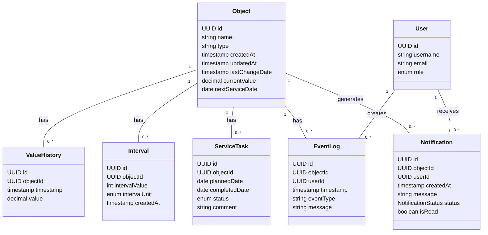

# 4	 ER диаграмма (описание)

## 4.1	Сущность: Object

| Поле            | Тип данных             | Описание                                   |
|-----------------|------------------------|-------------------------------------------|
| 🆔 🔑 id       | UUID                  | Уникальный идентификатор объекта           |
| 🏷️    name      | varchar(255)           | Имя объекта                                |
| 🔧type            | varchar(50)         | Тип объекта. Допустимые значения описаны ниже. |
| �status          | varchar(50)         | Статус объекта. Допустимые значения описаны ниже. |
| �📅createdAt       | timestamp           | Дата создания                              |
| ♻️updatedAt       | timestamp           | Дата последнего обновления                 |
| 🔄lastChangeDate  | timestamp           | Дата последнего изменения значения         |
| 📈 currentValue    | decimal(10,2)      | Текущее значение                           |
| 🛠️ nextServiceDate | date               | Дата следующего обслуживания               |

## 4.2	Сущность: ValueHistory

| Поле            | Тип данных            | Описание                                    |
|-----------------|-----------------------|---------------------------------------------|
| 🔑 id              |	UUID	              | Уникальный идентификатор объекта            |
|🔗 objectId	      | UUID (FK)	          | Идентификатор объекта (ссылка на Object.id) |
| imestamp	      | timestamp	          | Время фиксации значения                     |
| value	          | decimal(10,2)         | Сохранённое значение                        |

## 4.4	Сущность: Interval

| Поле            | Тип данных            | Описание                                    |
|-----------------|-----------------------|---------------------------------------------|
| 🔑 id	          | UUID	              | Уникальный идентификатор интервала          |
| 🔗 objectId	      | UUID (FK)	          | Идентификатор объекта (ссылка на Object.id) |
| intervalValue	  | int	                  | Числовое значение интервала                 |
| intervalUnit	  | enum(days, km, hours) |	Единица измерения интервала                 |
| createdAt	      | timestamp	          | Дата создания интервала                     |

### 4.4.1	Связи : для сущности Interval

|Родительская таблица |	Дочерняя таблица |	Тип связи	| Описание                             |
|---------------------|------------------|--------------|--------------------------------------|
| Object	          | Interval	     | 1 — n	    | Один объект имеет множество нтервалов|
			
## 4.5	Сущность: ServiceTask

| Поле            | Тип данных            | Описание                                    |
|-----------------|-----------------------|---------------------------------------------|
| 🔑 id	          | UUID	              | Уникальный идентификатор задачи             |
| 🔗 objectId	  | UUID (FK)	          | Идентификатор объекта (ссылка на Object.id) |
| plannedDate	  | date	              | Запланированная дата выполнения             |
| completedDate	  | date	              | Фактическая дата выполнения |
| status	      | enum(planned, in_progress,   completed, cancelled)	| Статус задачи |
| comment	      | varchar(255)	      | Комментарий |

### 4.5.1	Связи : для сущности ServiceTask

|Родительская таблица |	Дочерняя таблица |	Тип связи	| Описание                             |
|---------------------|------------------|--------------|--------------------------------------|
| Object	          | ServiceTask	     | 1 — n	    | Один объект имеет множество задач служивания|

## 4.6	Сущность: EventLog

| Поле            | Тип данных            | Описание                                    |
|-----------------|-----------------------|---------------------------------------------|
| 🔑 id	         | UUID	            | Уникальный идентификатор события |
| 🔗 objectId    | UUID (FK)	    | Идентификатор объекта (ссылка на Object.id) |
|    userId      | UUID (FK)	    | Идентификатор пользователя (ссылка на User.id) |
|    timestamp   | timestamp	    | Время события |
|    eventType	 | varchar(50)	    | Тип события |
|    message	 | varchar(255)	    | Текст сообщения |

### 4.6.1	Связи : для сущности EventLog

|Родительская таблица |	Дочерняя таблица |	Тип связи	| Описание                             |
|---------------------|------------------|--------------|--------------------------------------|
| Object	          | EventLog         | 1 — n		| Один объект имеет множество событий |
| User	              | EventLog         | 1 — n        | Один пользователь создаёт множество событий |

## 4.7 Сущность: User

| Поле            | Тип данных            | Описание                                    |
|-----------------|-----------------------|---------------------------------------------|
| 🔑 id	         | UUID	            | Уникальный идентификатор события |
| username  	  | varchar(100)	| Имя пользователя |
| email	          | varchar(255)	| Электронная почта |
| role	          |enum(admin, operator, viewer)	| Роль пользователя |

### 4.7.1	Связи : для сущности User

|Родительская таблица |	Дочерняя таблица |	Тип связи	| Описание                             |
|---------------------|------------------|--------------|--------------------------------------|
| User	| EventLog	  | 1 — n |	Пользователь создаёт события |
| User	| Notification	| 1 — n	| Пользователь получает уведомления |

## 4.8	Сущность: Notification

| Поле            | Тип данных            | Описание                                    |
|-----------------|-----------------------|---------------------------------------------|
| id	| UUID	| Уникальный идентификатор уведомления
| objectId |	UUID (FK) |	Идентификатор объекта (ссылка на Object.id)
| userId |	UUID (FK)	| Идентификатор пользователя (ссылка на User.id)
| createdAt	| timestamp	| Дата создания уведомления
| message	| varchar(255) | Текст уведомления
| status	| NotificationStatus | Статус обработки: `pending`, `sent`, `completed` или `cancelled`; по умолчанию `pending`
| isRead	| boolean	| Статус прочтения

### 4.8.1	Связи : для сущности Notification

|Родительская таблица |	Дочерняя таблица |	Тип связи	| Описание                             |
|---------------------|------------------|--------------|--------------------------------------|
| Object | Notification	| 1 — n	| Объект генерирует уведомления |
| User	 | Notification	| 1 — n	| Пользователь получает уведомления |

### 4.9 Class diagram

