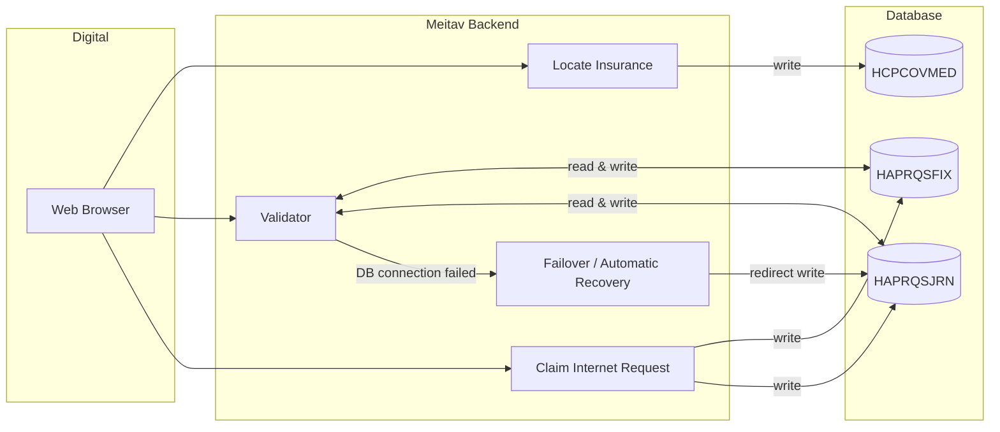

# MDC green path description

```mermaid
flowchart LR
    subgraph Digital
        browser[Web Browser]
    end

    subgraph Meitav Backend
        apiLocateInsurance[Locate Insurance]
        validator[Validator]
        claimInternetRequest[Claim Internet Request]
        recovery[Failover / Automatic Recovery]
    end

    subgraph Database
        HCPCOVMED[(HCPCOVMED)]
        HAPRQSJRN[(HAPRQSJRN)]
        HAPRQSFIX[(HAPRQSFIX)]
    end

    browser --> apiLocateInsurance
    browser --> validator
    browser --> claimInternetRequest
    
    apiLocateInsurance --> | write| HCPCOVMED
    
    %% Validator sync write
    validator <--> |read & write| HAPRQSFIX
    
    %% Validator afterward write
    validator <--> | read & write | HAPRQSJRN
    
    claimInternetRequest --> |write| HAPRQSFIX
    claimInternetRequest --> |write| HAPRQSJRN
    
    %% Failover logic
    validator -->|DB connection failed| recovery
    recovery -->|redirect write| HAPRQSJRN

```