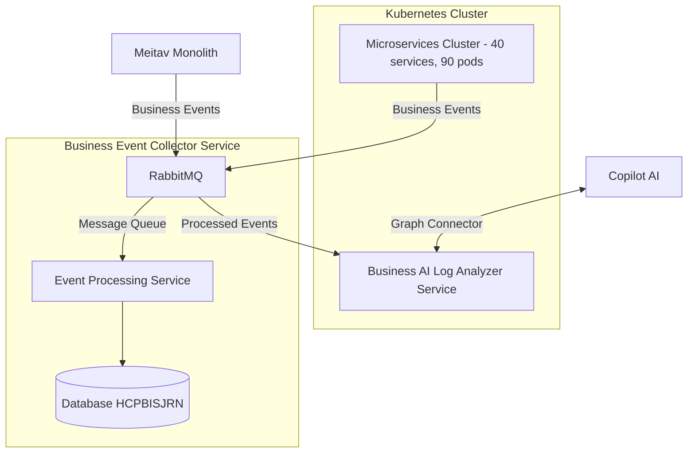

# Business Events Journal Management System

## Acronyms and Abbreviations

| Field  | Description |
| --- | --- |
| **BE** | Business Event  |
| **BEM** | Business Event Message  |
| **UUID** | Universally Unique Identifier  |

## Flow 





## Database structure


**Таблица**: HCPBISJRN

| Field  | Description |
| --- | --- |
| **TRACE_ID** | generated by opentelemetry-agent. The filed is associated with total process  |
| **SPAN_ID** |  generated by opentelemetry-agent.  The field is associatedt with finction or method from where send business event.|
| **PARENT_SPAN_ID** |  generated by opentelemetry-agent.  |
| **CATEGORY** | Describes business process (i.e. : calucaltion, letter generation, etc. ...) |
| **MODULE_NAME** | Either name of monolit or miscroservice name from was be sent Business Event |
| **METHOD_NAME** | Class & and method  name ℹ️(1) from where sent Business Event |
| **INSURED_ID_NUMBER** | Insured Id number sent for logging. |
| **CLAIM_ID** | Claim Id sent for logging. |
| **CLAIM_LINE_NUMMBER** | Uinique Id of line sent for logging |
| **STATUS** | Статус выполнения пайплайна: ``SUCCESS``, ``FAILED``, ``WARNING``. |
| **MESSAGE** | Business message ℹ️(2) (i.e. Data Class wiith all fields and values). |
| **RECEIVED_TiME** | Received Data & time  |

**Note**:  
 - ℹ️(1) - example for field ``METHDOD_NAME`` : LocatonInsuredService.getInsuredForHealthCoverages
 - ℹ️(2) - in case status = FAILED the field will be express error message

 ## Flow 

 ```mermaid

flowchart LR
    subgraph Microservices["40 Microservices"]
        JB1["Monolith Meitav S1"]
        JBn["Monolith Meitav S..."]
        MS1["Microservice A"]
        MS2["Microservice B"]
        MS3["Microservice C"]
        MSn["Microservice ..."]
    end

    OTel["OpenTelemetry Agent\n(trace_id + span_id)"]

    MQ["RabbitMQ Exchange\nbusiness.events"]

    BEC["Business Event Collector\n(Service)"]

    DB2["DB2/AS400"]

    T1["HCPBISJRN"]

    JB1 -->|"Business Operation"| OTel
    JBn -->|"Business Operation"| OTel
    MS1 -->|"Business Operation"| OTel
    MS2 -->|"Business Operation"| OTel
    MS3 -->|"Business Operation"| OTel
    MSn -->|"Business Operation"| OTel

    OTel -->|"Inject trace_id/span_id"| Microservices

    Microservices -->|"Publish BusinessEvent(JSON)"| MQ

    MQ -->|"Deliver Events"| BEC

    BEC -->|"Normalize & Process"| BEC

    BEC -->|"INSERT"| DB2

    DB2 --> T1

    BEC -->|"ACK"| MQ


```

## List of changes 

- create table in database
- create new microservice ``business-event-collecor-service``
- add to common meitav artifact mechanism sending BEM for reuse it as microservice 
- add in monlolith:
  - create ``Appender`` for log4j which will send message to Rabbit!
  - add to ``MDC`` of log4j: trace_id, span_id, modleName, CATEGORY, claim_id, insured_id_number and claim_line_number

## MCP = Microsoft Cloud Platform интеграционный слой для Copilot.

MCP can :
- understand data stucture
- perform queies
- answer on questions
- perform analyze bisiness logs
- perform investigation without UI

According to MCP Copilot can:
- work with meitav tables directly
- understand relationships between tables
- answer on questions
- perform investigation without UI
- perform SQL queries over Graph Connector
- explain error reasons

For perform all task defined above need to do :
 - DB2/AS40 have to be connecte to copilot over Microsoft Graph Connector
 - Define mapping every semanic object
 - Define skills

### Graph Connector to DB2 

This is one e APi and one endpoint which have return data per every DB table , i.e. HCPCLM, HCPLIN , etc...

The API must be based on GraphQL. For implemnting the Rest APi have to use Spring for GraphQL 

## Mapping for every semantic obejct

for example table : HCPCLM

```text
{
  "name": "Claim",
  "source": {
    "type": "external",
    "url": "https://your-api/graphql",
    "query": "{ claimById(claimId:\"{id}\") { claimId insuredId policyId status } }"
  },
  "fields": [
    {
      "name": "id",
      "source": "claimId",
      "type": "string",
      "key": true,
      "searchable": true,
      "retrievable": true
    },
    {
      "name": "insuredId",
      "source": "insuredId",
      "type": "string",
      "searchable": true,
      "retrievable": true
    },
    {
      "name": "policyId",
      "source": "policyId",
      "type": "string",
      "searchable": true,
      "retrievable": true
    },
    {
      "name": "status",
      "source": "status",
      "type": "string",
      "searchable": true,
      "retrievable": true
    }
  ]
}

{
  "relationships": [
    {
      "name": "claimLines",
      "source": "claimId",
      "target": "ClaimLine",
      "targetKey": "claimId",
      "type": "oneToMany"
    }
  ]
}


```

### Skils definition
 
 Define skills for investigation


 ## Spring AI implementation

 The framework allow automically perform some scenarios , for instance dependet on error generate prompt and send to copilot  

 ## Implementation Spring Modulith
  The framework allow to correct organize project , i.e. devide on region by use , for instance  define modules 
  - claim
  - claim-line
  - policy
  - letters
  - business-log
  - graphql
  - analysis-ai

