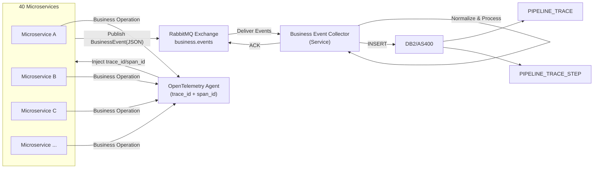
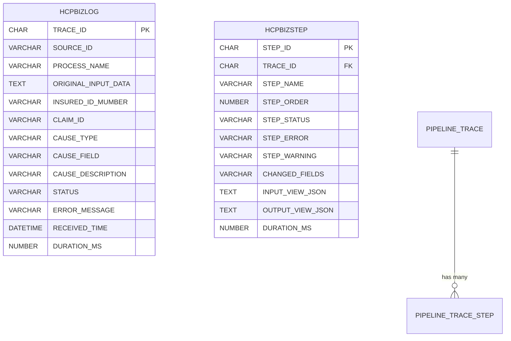
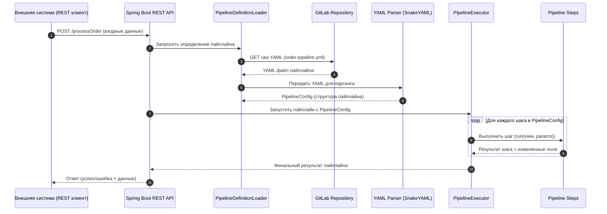

# Business Event Collector (BEC)

Need create new microservice ``business-event-collecor-service`` which will listent RabbitMq and when will detect messsage:
- read messege from rabbit MQ
- insert the message to database DB2/AS400

## Process flow 





## ERD



**Таблица**: HCPBIZLOG

| Поле | Описание |
| --- | --- |
| **TRACE_ID** | trace_id is generated by opentelemetry-agent.  |
| **SOURCE_ID** | Идентификатор запроса внешней системы (если есть: ``x-correlation-id``). |
| **PROCESS_NAME**| Name of process (pipe line) which is run
| **ORIGINAL_INPUT_DATA** | Received JSON without changes.  |
| **INSURED_ID_NUMBER** | Insured Id number sent by extrenal system. |
| **CLAIM_ID** | Claim Id sent by extrenal system. |
| **CAUSE_TYPE** | Тип причины ошибки: ``EXTERNAL``, ``INTERNAL``, ``UNKNOWN``. |
| *CAUSE_FIELD** | Поле, вызвавшее ошибку (например: ``price``, ``quantity``). |
| **CAUSE_DESCRIPTION** | Человеко‑читаемое объяснение причины. |
| **STATUS** | Статус выполнения пайплайна: ``SUCCESS``, ``FAILED``, ``WARNING``. |
| **ERROR_MESSAGE** | Сообщение об ошибке, если пайплайн завершился неуспешно. |
| **RECEIVED_TiME** | Received Data & time  |
| **DURATION_MS** | Elapsed time in ms. |


**Таблица**: HCPBIZSTEP

| Поле | Описание |
| --- | --- |
| **STEP_ID** | KSUID идентификатор шага. |
| **TRACE_ID** | Ссылка на ``PIPELINE_TRACE``. |
| **STEP_NAME** | Имя шага (например: ``Validate``, ``Enrich``, ``Calculate``, ``Persist``). |
| **STEP_ORDER** | Порядковый номер шага в пайплайне. |
|**STEP_TYPE**| LOCAL, MICROSERVICE, EXTERNAL. |
| **STEP_STATUS** | Статус шага: ``SUCCESS``, ``FAILED``, ``WARNING``. |
| **STEP_ERROR** | Ошибка, возникшая в шаге (если есть). |
| **STEP_WARNING** | Предупреждения шага (например: подозрительные входные данные). |
| **CHANGED_FIELDS** | Список полей, которые шаг изменил. |
| **INPUT_VIEW_JSON** | JSON‑представление данных, доступных шагу на входе. |
| **OUTPUT_VIEW_JSON** | JSON‑представление данных после выполнения шага. |
|**MICROSERVICE_NAME**| Microservive name (in case type = MICROSERVICE).|
|**METHOD_NAME**| Method or endpoint (in case type = MICROSERVICE).|
| **DURATION_MS** | Время выполнения шага. |


# Manage Pipeline definition

## GitLab architecture

```text
pipelines/
    order-pipeline.yml
    customer-pipeline.yml
    pricing-pipeline.yml

```

Spring Boot read yml files on start. Every yml files have to describe
- order of steps
- step parameters
- what fields are accessable 
- what fileds the step can change
- validation rule
- diagnose rule 

**Pipeline example**:

```text
pipeline:
  name: common-hero-integration-service 
  version: 1.0.1

steps:
  - name: validate
    type: local
    class: StepValidate
    view: ValidateView
    enabled: true

  - name: autenticattion
    type: microservice
    microservice: infras-authentication-service
    method:/check/${user_id}

  - name: remarkPersist
    type: local
    class: RemarkSaveServive
    view: RemarkView
    enabled: true
    params:
      generateKsuid: true
      setTimestamp: true

  - name: ClaimRemarkPersist
    type: local
    class: ClaimReamrkSaveService
    view: ClaimRemarkView
    enabled: true

  - name: ClaimTracePersist
    type: local
    class: ClaimTraceSave
    view: ClaimTraceView
    enabled: true


```
### Change infras-configuration-service

#### ``Application.yml`` chages

 This example import all yml files form folder "pipelines"
```text
paths:
  pipeline:
    - pipelines/*.yml

```

#### Add endpoints 

 ```text
 GET /config/pipelines/{name}
 GET /config/pipelines
 ```

### Sequence diagram of execute pipeline kept in GitHub(GitLab) 




## Save pipeline trace data into DB2/AS400

To best way is :
- Define special specal class(service) which is intended to save data to database
- Define the service as addition step in pipeline
- Perform save to database over ``RabbitQ`` nechanism for not impact on performace main process

**Note**: 
- need save as weel to log (text file):
    - текстовые сообщения
    - ошибки
    - stacktrace
    - debug‑информацию